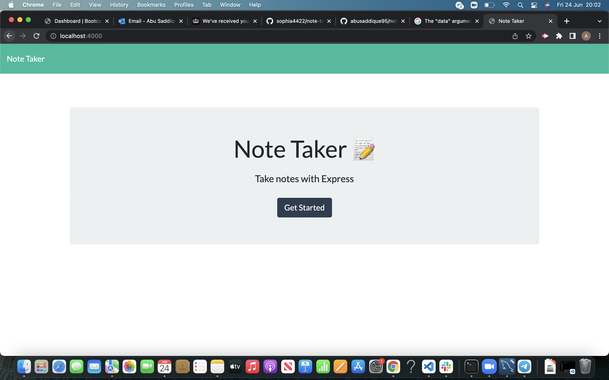
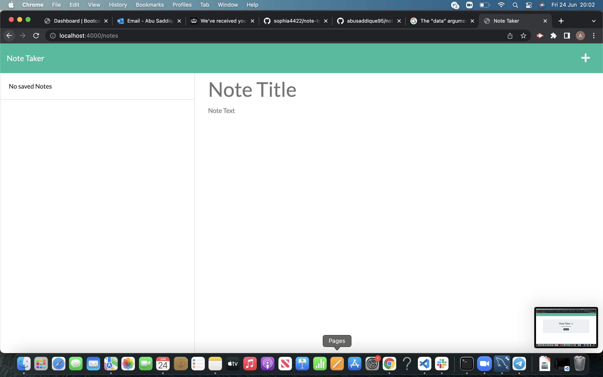
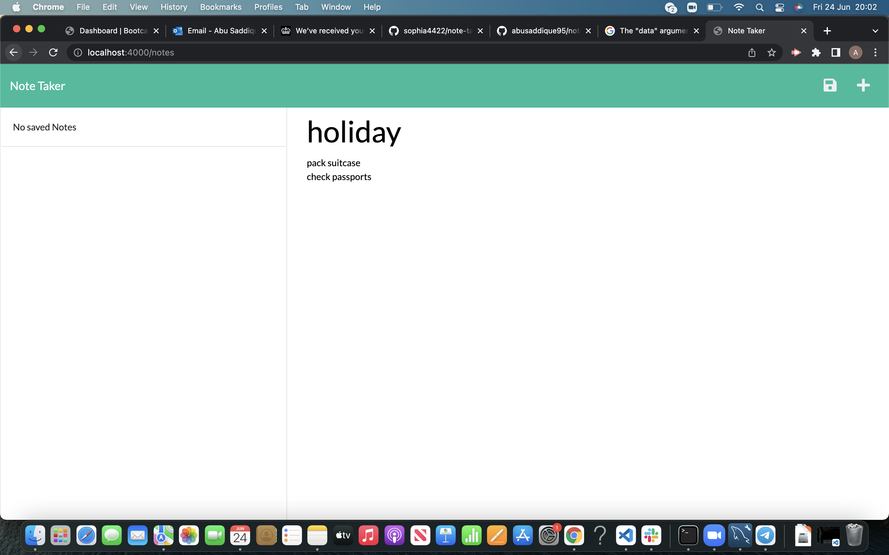
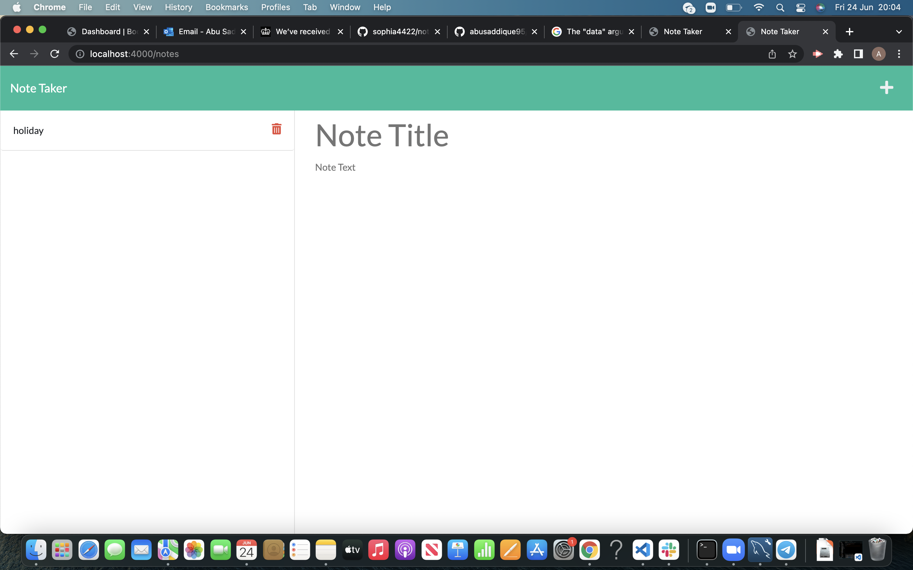

## Team Profile Generator 

## Table of Contents

- [Deployed Heroku link](#deployed-heroku-link)
- [Description](#description)
- [Installation](#installation)
- [Usage](#usage)
- [Technologies](#technologies)
- [Contact me](#contact-me)
- [Screenshots](#screenshots)

## Deployed Heroku link

## Description

This application will allow users to create and delete notes to make life and work schedule a little easier.

## Installation

```
git clone git@github.com:abusaddique95/note-taker.git
cd note-taker
code .
```

In terminal

```
npm install
```

## Usage

```

npm run start

```

## Technologies

- Node JS
- HTML, CSS, JS (front end)
- Express

## Contact me

If you have any further questions or would like to contact me my email is: abusaddique95@live.com

Visit my GitHub profile [here](https://github.com/abusaddique95)

## Screenshots





